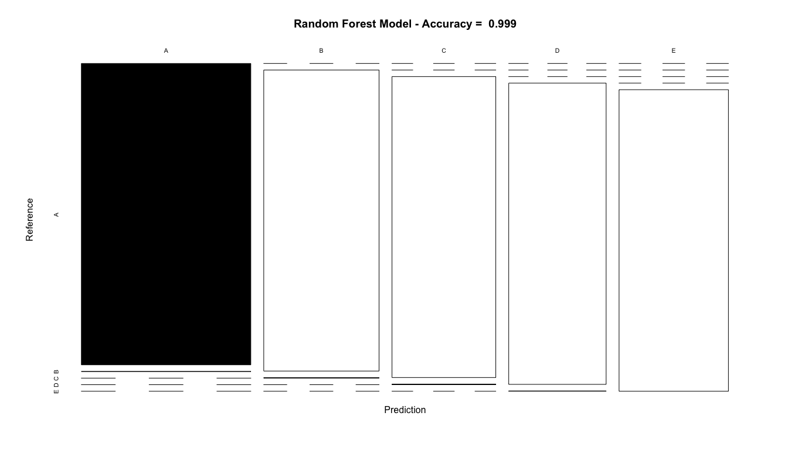
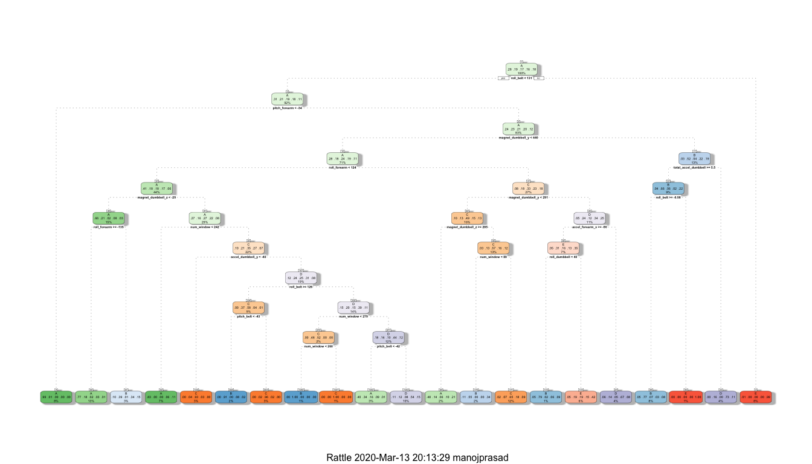
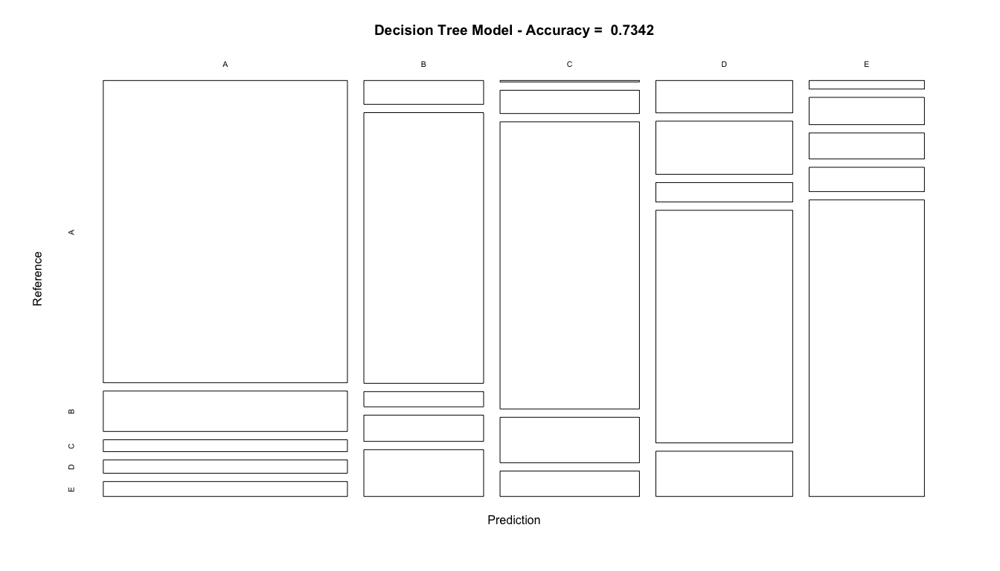
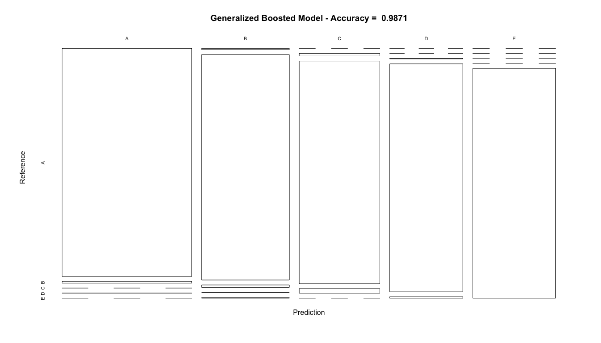

### <u><b> Overview </u></b>
 - This document serves as a Project report for the coursera course Practical Machine Learning
 - The goal is to explore data from accelerometers on the belt, forearm, arm, and dumbell of 6 participants
 - The "classe" variable from the dataset needs to be predicted for the provided Test Dataset
 - Different models would be trained against the provided training dataset and the most accurate model would be used to test against the test dataset

### <u><b> Environment Setup </u></b>
  - Lets load the required packages and set the seed for predictions
      
    
    ```r
    library(knitr)
    library(caret)
    library(rpart)
    library(rpart.plot)
    library(rattle)
    library(randomForest)
    library(corrplot)
    set.seed(12345)
    ```

### <u><b> Loading the Dataset </u></b>
* <u><b> Training Dataset </u></b>
    - Lets load the training dataset

    
    ```r
    trainingUrl <- "https://d396qusza40orc.cloudfront.net/predmachlearn/pml-training.csv"
    trainingDataset <- read.csv(url(trainingUrl))
    ```

* <u><b> Testing Dataset </u></b>
    - Lets load the testing dataset

    
    ```r
    testingUrl <- "https://d396qusza40orc.cloudfront.net/predmachlearn/pml-testing.csv"
    testingDataset <- read.csv(url(testingUrl))
    ```

### <u><b> Tidying/Cleaning the Dataset </u></b>
* <u><b> Dimensions </u></b>
    - Lets look at the dimensions of the raw testing and training datasets
    
    
    ```r
    dim(trainingDataset)
    ```
    
    ```
    ## [1] 19622   160
    ```
    
    ```r
    dim(testingDataset)
    ```
    
    ```
    ## [1]  20 160
    ```

* <u><b> Remove variables with Near Zero Variance (NZV) </u></b>
    - Lets remove variables having NZV on trainingDataset
    
    
    ```r
    nzv <- nearZeroVar(trainingDataset)
    trainingDataset <- trainingDataset[, -nzv]
    dim(trainingDataset)
    ```
    
    ```
    ## [1] 19622   100
    ```

* <u><b> Remove variables which are mostly NA </u></b>
    - Lets remove variables from trainingDataset having mostly NA values
    
    
    ```r
    allNA <- sapply(trainingDataset, function(x) mean(is.na(x))) > 0.95
    trainingDataset <- trainingDataset[, allNA == FALSE]
    dim(trainingDataset)
    ```
    
    ```
    ## [1] 19622    59
    ```

* <u><b> Remove variables not useful for prediction </u></b>
    - From the further inpsection into trainingDataset, seems like the first 5 columns are related to timestamps and username and can be removed since those are not useful for predictions
    
    
    ```r
    trainingDataset <- trainingDataset[, -(1:5)]
    dim(trainingDataset)
    ```
    
    ```
    ## [1] 19622    54
    ```

* <u><b> Training Dataset Partitioning </u></b>
    - Lets now partition the training dataset further into training and testing
    - Let 70% of the data be used for training and the rest 30% used for testing
    
    
    ```r
    inTrain <- createDataPartition(y = trainingDataset$classe, p = 0.7, list = FALSE)
    training <- trainingDataset[inTrain, ]
    testing <- trainingDataset[-inTrain, ]
    
    dim(training)
    ```
    
    ```
    ## [1] 13737    54
    ```
    
    ```r
    dim(testing)
    ```
    
    ```
    ## [1] 5885   54
    ```
    
### <u><b> Prediction via Models </u></b>
 - Lets try "Random Forests", "Decision Tree", "Generalized Boosted" Models to predict the classe variable
 - Confusion Matrix would be plotted for each of the model to understand the accuracy of the models
 - The most accurate model would be used to predict classe variable on "Testing" dataset

##### <u><b> Random Forests </u></b>
* <u><b> Training the Model </u></b>

```r
    set.seed(12345)
    control <- trainControl(method = "cv", number = 3, verboseIter = FALSE)
    rfModel <- train(classe ~ ., data = training, method = "rf", trControl = control)
    rfModel$finalModel
```

```
## 
## Call:
##  randomForest(x = x, y = y, mtry = param$mtry) 
##                Type of random forest: classification
##                      Number of trees: 500
## No. of variables tried at each split: 27
## 
##         OOB estimate of  error rate: 0.23%
## Confusion matrix:
##      A    B    C    D    E  class.error
## A 3904    2    0    0    0 0.0005120328
## B    6 2647    4    1    0 0.0041384500
## C    0    5 2391    0    0 0.0020868114
## D    0    0    9 2243    0 0.0039964476
## E    0    0    0    5 2520 0.0019801980
```

* <u><b> Prediction on Test Dataset </u></b>

```r
    rfTestPrediction <- predict(rfModel, newdata = testing)
    rfConfusionMatrix <- confusionMatrix(rfTestPrediction, testing$classe)
    print(rfConfusionMatrix)
```

```
## Confusion Matrix and Statistics
## 
##           Reference
## Prediction    A    B    C    D    E
##          A 1674    1    0    0    0
##          B    0 1138    2    0    0
##          C    0    0 1024    2    0
##          D    0    0    0  962    1
##          E    0    0    0    0 1081
## 
## Overall Statistics
##                                           
##                Accuracy : 0.999           
##                  95% CI : (0.9978, 0.9996)
##     No Information Rate : 0.2845          
##     P-Value [Acc > NIR] : < 2.2e-16       
##                                           
##                   Kappa : 0.9987          
##                                           
##  Mcnemar's Test P-Value : NA              
## 
## Statistics by Class:
## 
##                      Class: A Class: B Class: C Class: D Class: E
## Sensitivity            1.0000   0.9991   0.9981   0.9979   0.9991
## Specificity            0.9998   0.9996   0.9996   0.9998   1.0000
## Pos Pred Value         0.9994   0.9982   0.9981   0.9990   1.0000
## Neg Pred Value         1.0000   0.9998   0.9996   0.9996   0.9998
## Prevalence             0.2845   0.1935   0.1743   0.1638   0.1839
## Detection Rate         0.2845   0.1934   0.1740   0.1635   0.1837
## Detection Prevalence   0.2846   0.1937   0.1743   0.1636   0.1837
## Balanced Accuracy      0.9999   0.9994   0.9988   0.9989   0.9995
```

* <u><b> Model Accuracy Plot </u></b>

```r
    plot(rfConfusionMatrix$table, col = rfConfusionMatrix$byClass, 
         main = paste("Random Forest Model - Accuracy = ",
                      round(rfConfusionMatrix$overall['Accuracy'], 4)))
```

<!-- -->

##### <u><b> Decision Tree </u></b>
* <u><b> Training the Model </u></b>

```r
    set.seed(12345)
    dtModel <- rpart(classe ~ ., data = training, method = "class")
    fancyRpartPlot(dtModel)
```

<!-- -->

* <u><b> Prediction on Test Dataset </u></b>

```r
    dtTestPrediction <- predict(dtModel, newdata = testing, type = "class")
    dtConfusionMatrix <- confusionMatrix(dtTestPrediction, testing$classe)
    print(dtConfusionMatrix)
```

```
## Confusion Matrix and Statistics
## 
##           Reference
## Prediction    A    B    C    D    E
##          A 1502  201   59   66   74
##          B   58  660   37   64  114
##          C    4   66  815  129   72
##          D   90  148   54  648  126
##          E   20   64   61   57  696
## 
## Overall Statistics
##                                           
##                Accuracy : 0.7342          
##                  95% CI : (0.7228, 0.7455)
##     No Information Rate : 0.2845          
##     P-Value [Acc > NIR] : < 2.2e-16       
##                                           
##                   Kappa : 0.6625          
##                                           
##  Mcnemar's Test P-Value : < 2.2e-16       
## 
## Statistics by Class:
## 
##                      Class: A Class: B Class: C Class: D Class: E
## Sensitivity            0.8973   0.5795   0.7943   0.6722   0.6433
## Specificity            0.9050   0.9425   0.9442   0.9151   0.9579
## Pos Pred Value         0.7897   0.7074   0.7505   0.6079   0.7751
## Neg Pred Value         0.9568   0.9033   0.9560   0.9344   0.9226
## Prevalence             0.2845   0.1935   0.1743   0.1638   0.1839
## Detection Rate         0.2552   0.1121   0.1385   0.1101   0.1183
## Detection Prevalence   0.3232   0.1585   0.1845   0.1811   0.1526
## Balanced Accuracy      0.9011   0.7610   0.8693   0.7936   0.8006
```
* <u><b> Model Accuracy </u></b>

```r
    plot(dtConfusionMatrix$table, col = dtConfusionMatrix$byClass,
         main = paste("Decision Tree Model - Accuracy = ",
                      round(dtConfusionMatrix$overall['Accuracy'], 4)))
```

<!-- -->

##### <u><b> Generalized Boosted </u></b>
* <u><b> Training the Model </u></b>

```r
    set.seed(12345)
    control <- trainControl(method = "repeatedcv", number = 5, repeats = 1)
    gbModel  <- train(classe ~ ., data = training, method = "gbm",
                        trControl = control, verbose = FALSE)
    print(gbModel$finalModel)
```

```
## A gradient boosted model with multinomial loss function.
## 150 iterations were performed.
## There were 53 predictors of which 53 had non-zero influence.
```

* <u><b> Prediction on Test Dataset </u></b>

```r
    gbTestPrediction <- predict(gbModel, newdata = testing)
    gbConfusionMatrix <- confusionMatrix(gbTestPrediction, testing$classe)
    print(gbConfusionMatrix)
```

```
## Confusion Matrix and Statistics
## 
##           Reference
## Prediction    A    B    C    D    E
##          A 1668   12    0    1    0
##          B    6 1115   12    1    3
##          C    0   12 1012   21    0
##          D    0    0    2  941    6
##          E    0    0    0    0 1073
## 
## Overall Statistics
##                                           
##                Accuracy : 0.9871          
##                  95% CI : (0.9839, 0.9898)
##     No Information Rate : 0.2845          
##     P-Value [Acc > NIR] : < 2.2e-16       
##                                           
##                   Kappa : 0.9837          
##                                           
##  Mcnemar's Test P-Value : NA              
## 
## Statistics by Class:
## 
##                      Class: A Class: B Class: C Class: D Class: E
## Sensitivity            0.9964   0.9789   0.9864   0.9761   0.9917
## Specificity            0.9969   0.9954   0.9932   0.9984   1.0000
## Pos Pred Value         0.9923   0.9807   0.9684   0.9916   1.0000
## Neg Pred Value         0.9986   0.9949   0.9971   0.9953   0.9981
## Prevalence             0.2845   0.1935   0.1743   0.1638   0.1839
## Detection Rate         0.2834   0.1895   0.1720   0.1599   0.1823
## Detection Prevalence   0.2856   0.1932   0.1776   0.1613   0.1823
## Balanced Accuracy      0.9967   0.9871   0.9898   0.9873   0.9958
```

* <u><b> Model Accuracy </u></b>

```r
    plot(gbConfusionMatrix$table, col = gbConfusionMatrix$byClass, 
         main = paste("Generalized Boosted Model - Accuracy = ", 
         round(gbConfusionMatrix$overall['Accuracy'], 4)))
```

<!-- -->

### <u><b> Model against Testing Dataset </u></b>
 - The accuracies of the models tried are as follows
    * "Random Forests"      : Accuracy = 0.999
    * "Decision Tree"       : Accuracy = 0.7342
    * "Generalized Boosted" : Accuracy = 0.9871
 - "Random Forests" was the most accurate model. Lets execute that against testingDataset to predict the classe variable


```r
testPredictions <- predict(rfModel, newdata = testingDataset)
testPredictions
```

```
##  [1] B A B A A E D B A A B C B A E E A B B B
## Levels: A B C D E
```
